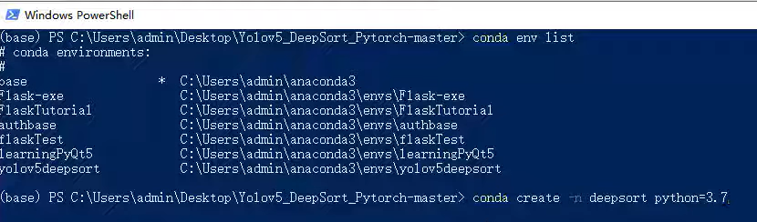

# Yolov5_DeepSort_Pytorch_运行记录

## 环境
1. 建立新的环境 deepsort  
``conda create -n deepsort python=3.7``  

2. 激活环境  
``conda activate deepsort``

3. 安装requirements所需环境  
``pip install -r .\requirements.txt``

4.运行
``conda activate deepsort``  
``python track.py --source foot.mp4 --show-vid --save-vid``